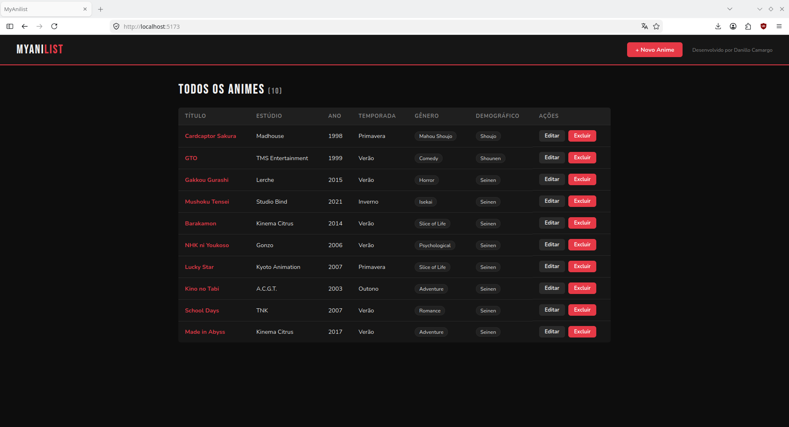
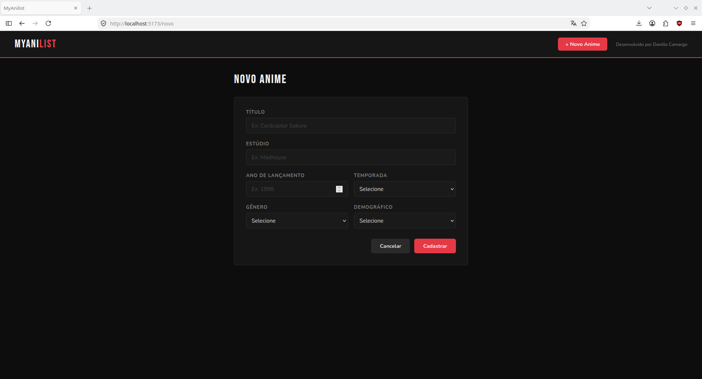
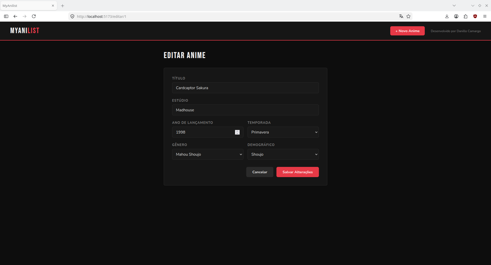
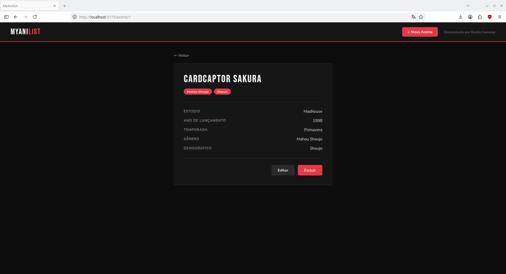

# MyAnilist — CRUD de Animes

Trabalho da disciplina **Experiência Criativa: Inovando Colaborativamente**.

Sistema web completo para gerenciamento de animes, desenvolvido com React, Node.js e MySQL.

---

## Screenshots

### Listagem de Animes


### Cadastro de Anime


### Edição de Anime


### Detalhes do Anime


---

## Tecnologias

- **Frontend:** React 18, Vite, CSS Modules, Axios, React Router
- **Backend:** Node.js, Express
- **Banco de Dados:** MySQL

---

## Estrutura de Pastas

```
├── backend/
│   ├── controllers/
│   │   └── animeController.js
│   ├── routes/
│   │   └── anime.js
│   ├── db.js
│   ├── server.js
│   └── package.json
│
├── frontend/
│   ├── src/
│   │   ├── api/
│   │   │   └── anime.js
│   │   ├── pages/
│   │   │   ├── ListaAnime.jsx
│   │   │   ├── FormAnime.jsx
│   │   │   └── DetalhesAnime.jsx
│   │   ├── App.jsx
│   │   ├── App.module.css
│   │   ├── main.jsx
│   │   └── index.css
│   ├── index.html
│   ├── vite.config.js
│   └── package.json
│
└── anime.sql
```

---

## Pré-requisitos

Antes de rodar o projeto, certifique-se de ter instalado:

- [Node.js](https://nodejs.org/)
- [MySQL](https://www.mysql.com/)

---

## Como Rodar o Projeto

### 1. Clonar o repositório

```bash
git clone https://github.com/danltargz/crud-anime.git
cd crud-anime
```

### 2. Importar o banco de dados

1. Abra o **MySQL Workbench**
2. Vá em `File > Open SQL Script` e selecione o arquivo `anime.sql` na raiz do projeto
3. Execute o script clicando em ⚡
4. O banco `anime_db` e a tabela `anime` serão criados automaticamente com dados de exemplo

### 3. Configurar a senha do MySQL

Abra o arquivo `backend/db.js` e preencha o campo `password` com a sua senha do MySQL:

```js
const connection = mysql.createConnection({
  host: "localhost",
  user: "root",
  password: "SUA_SENHA_AQUI",
  database: "anime_db",
});
```

> Se o seu MySQL não tiver senha, deixe o campo vazio: `password: ""`

### 4. Rodar o backend

Abra um terminal na pasta `backend/` e execute:

```bash
npm install
npm run dev
```

✅ O servidor estará rodando em `http://localhost:3001`

### 5. Rodar o frontend

Abra **outro terminal** na pasta `frontend/` e execute:

```bash
npm install
npm run dev
```

✅ Acesse o sistema em `http://localhost:5173`

> ⚠️ Os dois terminais precisam ficar abertos ao mesmo tempo para o sistema funcionar.

---

## Funcionalidades

- Listagem de animes com paginação
- Cadastro de novo anime
- Edição de anime existente
- Exclusão de anime
- Visualização detalhada de um anime

---

## Desenvolvido por

Danillo Camargo
